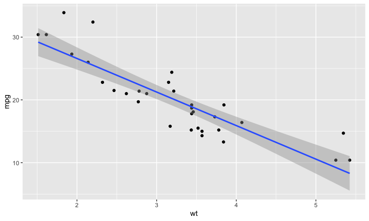

## Reproducible pitch

This is for Course Project: Shiny Application and Reproducible Pitch. 

- Github repo please see: <https://github.com/YihaoYang/shiny-application-and-reproducible-pitch>.
- Shiny Application please see: <https://yihaoy.shinyapps.io/ShinyApp/>.
- Reproducible Pitch please see: <>.

## Background
The experiment is based on `mtcars` dataset. According to R documentation, 

> It is a data frame with 32 observations on 11 (numeric) variables.\
[, 1]	mpg	Miles/(US) gallon\
[, 2]	cyl	Number of cylinders\
[, 3]	disp	Displacement (cu.in.)\
[, 4]	hp	Gross horsepower\
[, 5]	drat	Rear axle ratio\
[, 6]	wt	Weight (1000 lbs)\
[, 7]	qsec	1/4 mile time\
[, 8]	vs	Engine (0 = V-shaped, 1 = straight)\
[, 9]	am	Transmission (0 = automatic, 1 = manual)\
[,10]	gear	Number of forward gears\
[,11]	carb	Number of carburetors\

## mtcars dataset

```r
str(mtcars)
```

```
## 'data.frame':	32 obs. of  11 variables:
##  $ mpg : num  21 21 22.8 21.4 18.7 18.1 14.3 24.4 22.8 19.2 ...
##  $ cyl : num  6 6 4 6 8 6 8 4 4 6 ...
##  $ disp: num  160 160 108 258 360 ...
##  $ hp  : num  110 110 93 110 175 105 245 62 95 123 ...
##  $ drat: num  3.9 3.9 3.85 3.08 3.15 2.76 3.21 3.69 3.92 3.92 ...
##  $ wt  : num  2.62 2.88 2.32 3.21 3.44 ...
##  $ qsec: num  16.5 17 18.6 19.4 17 ...
##  $ vs  : num  0 0 1 1 0 1 0 1 1 1 ...
##  $ am  : num  1 1 1 0 0 0 0 0 0 0 ...
##  $ gear: num  4 4 4 3 3 3 3 4 4 4 ...
##  $ carb: num  4 4 1 1 2 1 4 2 2 4 ...
```


## example regression experiment


```r
require(ggplot2)
ggplot(data=mtcars,aes(wt,mpg))+geom_point()+geom_smooth(method='lm',aes(group=1))
```

<!-- -->

